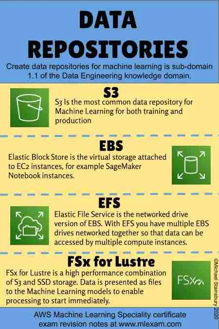

# Data Repositories and Storage Types on AWS

## Blob/Object Storage

### [Amazon S3](https://aws.amazon.com/s3/)

### [Amazon EBS (Elastic Block Store)](https://aws.amazon.com/ebs/)

### [Amazon EFS (Elastic File Service)](https://aws.amazon.com/efs/)

### [Amazon FSx for Lustre](https://aws.amazon.com/fsx/lustre/)

## Data Lake Storage

### [AWS Lake Formation](https://aws.amazon.com/lake-formation/)

## Relational Databases

### [Amazon RDS/Aurora (Relational Database Service)](https://aws.amazon.com/rds/) for OLTP

- [MariaDB](https://mariadb.org/)
- [Microsoft SQL Server](https://www.microsoft.com/en-us/sql-server)
- [MySQL](https://www.mysql.com/)
- [Oracle](https://www.oracle.com/database/)
- [PostgreSQL](https://www.postgresql.org/)

### [Amazon Redshift](https://aws.amazon.com/redshift/): Data Warehousing for OLAP, SQL

## NoSQL Databases

### [Amazon DynamoDB](https://aws.amazon.com/dynamodb/) (Managed NoSQL database)

### [Amazon DocumentDB](https://aws.amazon.com/documentdb/) (MongoDB-compatible)

### [Amazon Keyspaces](https://aws.amazon.com/keyspaces/) (Apache Cassandra-compatible)

## In-Memory Databases

### [Amazon ElastiCache](https://aws.amazon.com/elasticache/) (Caching service for Redis and Memcached)

### [Amazon MemoryDB for Redis](https://aws.amazon.com/memorydb/)

## Graph Databases

### [Amazon Neptune](https://aws.amazon.com/neptune/)

## Time-Series Databases

### [Amazon Timestream](https://aws.amazon.com/timestream/)

